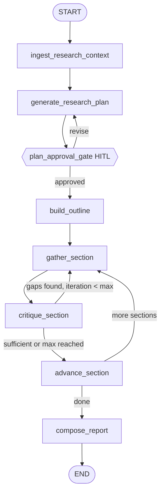

# Adaptive Call Prep

An AI agent that preps a salesperson for an upcoming call: propose a research plan
scoped to the deal, let a human approve or revise it, then research autonomously —
reflecting on its own findings and looping back for more when it finds a real gap —
before composing a call-ready action plan (suggested opener, ranked discovery
questions, anticipated objections with responses), fully cited.

**This is a from-scratch portfolio demo.** The company, scenario, and data are entirely
fictional ("Alderleaf Robotics," a made-up industrial robotics company). It exists to
demonstrate a set of engineering patterns I use in production agent work — LangGraph
`interrupt()`-based human-in-the-loop, a bounded reflect-and-refine research loop, and a
real streaming React frontend — without exposing any actual client code or data.

Requires an `ANTHROPIC_API_KEY` — plan generation, critique, and report composition all
need a real model call, and there's no deterministic template fallback for this flow.

---

## Why this shape

Inspired by Google's ["Deep Search" ADK sample](https://github.com/google/adk-samples/tree/main/python/agents/deep-search)
and its predecessor, the LangGraph-native
[Gemini Fullstack Quickstart](https://github.com/google-gemini/gemini-fullstack-langgraph-quickstart)
— both share a two-phase shape (propose a plan → human approves/revises it →
autonomous research with a reflect-and-refine loop → cited report), and the latter maps
directly onto a LangGraph backend.

**This isn't a reskin of that pattern with sales fixture data plugged into generic
slots.** The plan, the critique, and the final output are all reasoned about through a
sales lens, not a generic-research one:

- **Plan generation reasons about `deal_stage`.** A `cold_outbound` call gets a
  different plan than a `negotiation`-stage one — goals are framed as real sales-prep
  needs (mapping the buying committee, assessing fit/pain, gauging competitive
  displacement risk, finding a warm opener), and each goal carries an explicit
  `why_it_matters_for_this_call` field, not just a research topic.
- **The critique step's "is this enough" question is sales-specific**, not generic
  completeness: *"would {salesperson} feel ready to run this {meeting_type} at the
  {deal_stage} stage with what's been found?"* — gaps read as sales blind spots ("no
  signal on who holds budget authority"), not research thinness.
- **The output is a call-ready action plan, not a research report**: a suggested
  opener, ranked discovery questions, and anticipated objections with suggested
  responses — the concrete artifact a rep actually opens before the call, built by an
  adaptive process that went and closed real gaps first, not a fixed synthesis pass
  over static data.

---

## Quickstart

### Prerequisites

- Python 3.10+
- An Anthropic API key — get one at [console.anthropic.com](https://console.anthropic.com/settings/keys).
  There's no free/offline fallback for this repo; every path below needs it.
- Node.js 20+ / npm — **only** if you want the frontend, not the CLI

### 1. Clone and install

```bash
git clone https://github.com/zquart8095/sales-call-prep-agent.git
cd sales-call-prep-agent
python3 -m venv .venv
.venv/bin/pip install -r requirements.txt
```

### 2. Add your API key

Create a `.env` file in the repo root:
```bash
echo "ANTHROPIC_API_KEY=sk-ant-your-key-here" > .env
```
This one `.env` powers both paths below — the CLI loads it directly, and
`langgraph.json` points `langgraph dev` at the same file, so the frontend picks it up
too. Nothing else needs configuring.

### 3. Run it — CLI (fastest, no Node needed)

```bash
.venv/bin/python -m sales_prep.cli research
```
Prints the proposed plan, prompts `[a]pprove` or type feedback to revise, then streams
progress to stdout through the autonomous phase and prints the full report + action
plan + citations at the end.

Try an unlisted company to see the graceful fixture-fallback path (no crash, clearly
labeled placeholder content):
```bash
.venv/bin/python -m sales_prep.cli research --context data/call_contexts/unlisted_prospect.json
```

### 3 (alternative) — Run it with the real frontend

```bash
# terminal 1 — serves the graph with real streaming, via LangGraph's own dev server
.venv/bin/pip install -r requirements-dev.txt
.venv/bin/langgraph dev --port 2024

# terminal 2
cd frontend
npm install
npm run dev
```
Open `http://localhost:5173` — there's a "Load Alderleaf demo" button to prefill a
sample call context. `langgraph.json` (repo root) points at
`sales_prep/research_agent/graph.py:graph` — the frontend talks to it via
`@langchain/langgraph-sdk`'s `useStream` hook, which drives the live Activity Timeline
and surfaces the plan-approval interrupt.

`langgraph-cli[inmem]` is kept in a separate `requirements-dev.txt`, not folded into
`requirements.txt` — it pulls in a real server stack (uvicorn, etc.) that only matters
for the frontend-serving path.

### 4. Confirm everything's wired up

```bash
.venv/bin/python -m pytest tests/
```
All tests run offline against fake LLM clients — no API key spent, no network calls.
See **Testing** below for what each file covers.

---

## Architecture



`sales_prep/research_agent/` reuses fixture providers (`sales_prep/providers/` — four
`Protocol`-shaped adapters over bundled JSON, with a clearly-labeled `is_demo_fallback`
path for unlisted companies) for the initial pass over each research goal, plus
Anthropic's hosted `web_search` tool for the reflect-loop's follow-up research — the
one place this flow reaches beyond the fixtures, so "reflect and refine" is genuinely
doing something rather than re-querying static data with cosmetic param tweaks.

- **Sequential per-section, not LangGraph `Send`-based fan-out.** A `Send` fan-out
  would need an `Annotated` reducer for concurrent writes to `sections`, and would
  interleave the Activity Timeline nondeterministically — actively working against the
  frontend's core visual (a readable, ordered stream of what the agent is doing). The
  state (`sections` keyed by `goal_id`) is shaped so this could migrate to `Send` later
  without a redesign.
- **Purpose-built `ResearchReport`/`Citation`/`CallActionPlan` models.** `compose_report`
  builds the citation registry in Python *before* calling the LLM (fixture-derived
  citations get `url=None`, real web citations get a real URL) — the model only ever
  sees the registry, so it can't invent a URL or a fact not present in the findings.
- **Testability via constructor injection.** Every LLM-calling node is a factory
  (`make_generate_research_plan(client=None)`), and `build_graph(anthropic_client=None)`
  threads one injected client through all of them — tests drive the **whole compiled
  graph** via `.invoke()`/`Command(resume=...)` with a fake Anthropic client
  (`tests/fakes.py`), no monkeypatching.
- **Raw `anthropic` SDK, no LangChain model wrapper.** Every LLM call goes through
  `client.messages.create(...)` directly (see `llm_json.py::call_for_json`) — kept
  consistent across every LLM-calling node in this repo rather than mixing in
  `langchain-anthropic` for some paths.

### Orchestration engine: LangGraph vs. Google ADK

Built on **LangGraph** (`StateGraph`, `interrupt()`), but I've also built the equivalent
topology on **Google's Agent Development Kit** (its graph-based `Workflow` API —
`nodes`/`edges`/`JoinNode`/`RequestInput`) in production client work. The two are a real
trade-off, not just a coin flip:

| | LangGraph | Google ADK (Workflow API) |
|---|---|---|
| Setup to run locally | `pip install langgraph` | GCP project, `agents-cli` scaffolding |
| HITL primitive | `interrupt()` / `Command(resume=...)` | `RequestInput` / `ctx.resume_inputs` |
| Ecosystem recognition | Broad, framework-agnostic | Newer, Google-specific |
| Natural deploy target | Anywhere (Docker, Lambda, etc.) | Vertex AI Agent Runtime, Cloud Run, GKE |

LangGraph was the right choice here specifically because `langgraph dev`'s local
in-memory server is exactly what a real streaming frontend needs, with no cloud project
required. ADK's Workflow API is the better choice when a Google-Cloud-native deploy
target is already part of the plan.

### Optional LangSmith tracing

Set `LANGSMITH_API_KEY` **and** `LANGSMITH_TRACING=true` in `.env` (both required — the
key alone doesn't turn tracing on, a real LangSmith gotcha) and every node in the graph
shows up as its own span automatically (native LangGraph behavior), plus
`sales_prep/observability/tracing.py::wrap_anthropic_if_enabled` wraps the Anthropic
client so LLM calls show up as nested spans with full prompt/response — a no-op
passthrough when tracing is off, verified in `tests/test_observability.py` against the
real gating logic (key-without-flag stays off, `wrap_anthropic_if_enabled` is a true
no-op when disabled).

---

## Verified for real — including two real bugs it caught

Ran full sessions through both the CLI and the actual browser frontend (real Anthropic
calls, real `langgraph dev` server, real Chrome automation — not simulated): proposed a
plan, revised it with feedback, watched it correctly restructure goals around the
feedback, approved it, watched the reflect-loop *actually* fire (a section got
critiqued as insufficient, triggered a real follow-up web search, got re-critiqued as
sufficient), and got a complete, well-grounded final report with a genuinely useful
call action plan.

Two real bugs found and fixed during that verification, not hypotheticals:
- **`compose_report`'s JSON got truncated mid-string** on a 5-goal plan —
  `max_tokens=1536` (the default for `call_for_json`) was too small for composing that
  much section narrative plus a full action plan. Fixed by raising it to `8192` for
  this specific call *and* tightening the prompt to explicitly ask for concise (2-4
  sentence) section narrative — both reduces truncation risk and produces a more
  scannable pre-call brief, which was the actual design goal anyway.
- **`ReportView` only resolved `[cite-N]` markers in per-section narrative, not the
  executive summary** — the model sometimes cites sources in the summary too
  (reasonably; nothing in the prompt forbade it), so those markers were rendering as
  literal `[cite-1]` text instead of styled citation links. Fixed by routing the
  executive summary through the same marker-resolution function.

**A real, honest finding, not a bug**: because "Jordan Ellery" and "Sam Okafor" are
fictional demo names, live `web_search` returns a lot of irrelevant real people who
happen to share those names (LinkedIn profiles, Wikipedia pages, TikTok accounts) —
noisy citations. The composed report handled this correctly on its own: it explicitly
caveated that *"public web search could not independently corroborate company or
contact details... treat org-chart and authority specifics as unverified until
confirmed live on the call"* rather than presenting noisy search hits as confirmed
facts. Worth knowing if you swap in a real prospect name — the mismatch goes away
entirely.

---

## Testing

```bash
.venv/bin/python -m pytest tests/
```

- `test_providers_fixtures.py` — known-domain and unknown-domain (fallback) paths for
  all four fixture providers
- `test_observability.py` — LangSmith tracing graceful degradation (off by default,
  key-without-flag stays off, `wrap_anthropic_if_enabled` is a true no-op when disabled)
- `test_research_agent_graph.py` — the **full graph** through `Command(resume=...)`, via
  a fake Anthropic client (`tests/fakes.py`): plan approved first try, the
  plan-revision loop (a second interrupt with an incremented `plan_revision`), the
  reflect-loop actually triggering a follow-up `gather_section` call, the loop
  correctly bounded by `max_iterations_per_section` even when critique never says
  "sufficient," and the malformed-JSON-then-valid retry path recovering
- `test_research_agent_nodes.py` — pure router functions and `build_outline` in
  isolation; asserts `gather_section`'s first pass never touches the injected LLM
  client (a client with zero scripted responses would raise if it were)
- `test_research_agent_compose.py` — citation-registry assembly: stable `cite-N` ids,
  fixture citations never get a fabricated URL

---

## Repo layout

```
sales-call-prep-agent/
├── README.md
├── langgraph.json                 # serves research_agent via `langgraph dev`
├── requirements-dev.txt           # requirements.txt + langgraph-cli[inmem]
├── data/call_contexts/            # fictional call-context inputs
├── sales_prep/
│   ├── config.py                  # CallContext
│   ├── cli.py                     # `research` subcommand
│   ├── providers/                 # 4 Protocols + fixture implementations
│   ├── observability/             # optional LangSmith tracing (tracing.py)
│   └── research_agent/            # plan/gate/outline/gather/critique/compose + graph.py
├── frontend/                      # React + Vite + Tailwind + Shadcn UI
└── tests/
```

---

## What this intentionally omits

- **No real vendor integrations** — fixture data only, by design (see Architecture
  above). Swapping in a real company-data API, news API, or people-search API is
  exactly the seam `providers/` exists for.
- **No dual orchestration-engine implementation.** I've built the ADK equivalent in
  production client work (see the trade-off table above), but building both here would
  be scope creep for a single portfolio repo.
- **No persistence across process restarts** — `MemorySaver` checkpointer only for the
  CLI; the frontend's `langgraph dev` server is dev-only, in-memory state. A real
  deployment would use a durable checkpointer (Postgres, SQLite) so a paused
  plan-review survives a restart.
- **No `Send`-based parallel fan-out** for research sections (see Architecture above) —
  sequential, bounded, and deliberately keeps the Activity Timeline readable.

---

## License

MIT
